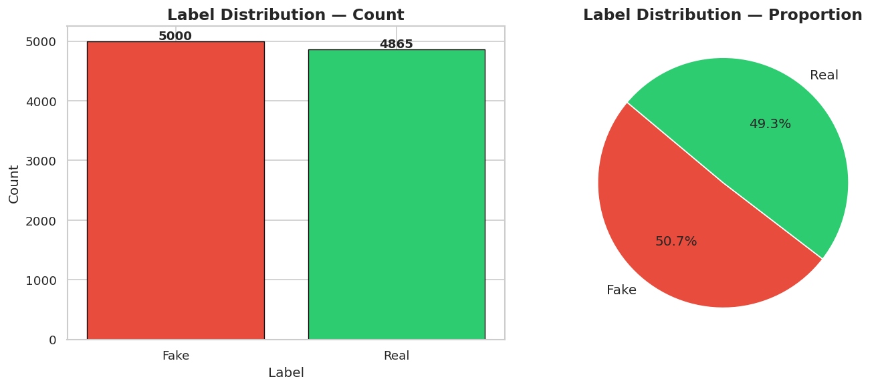
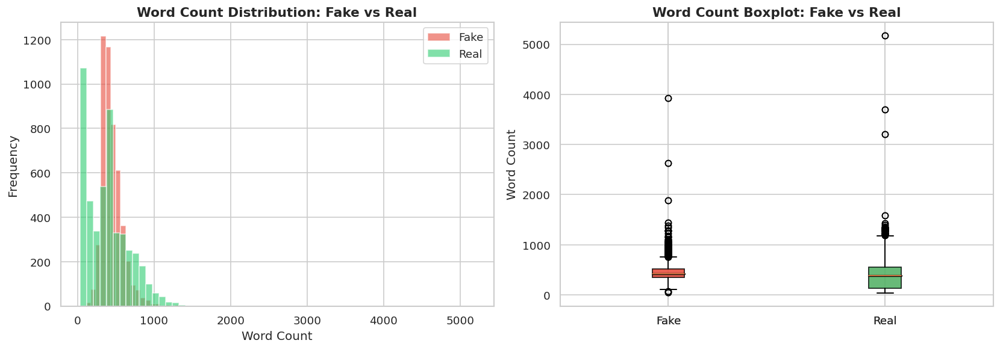
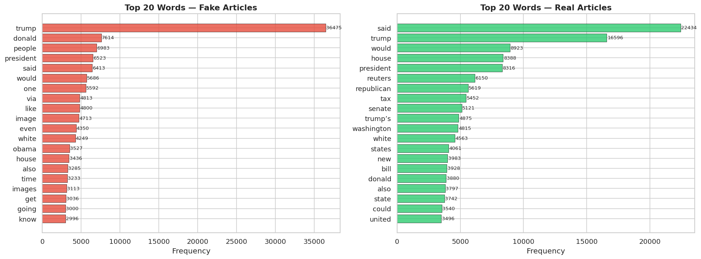
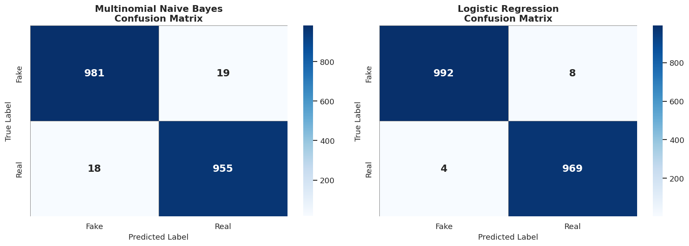
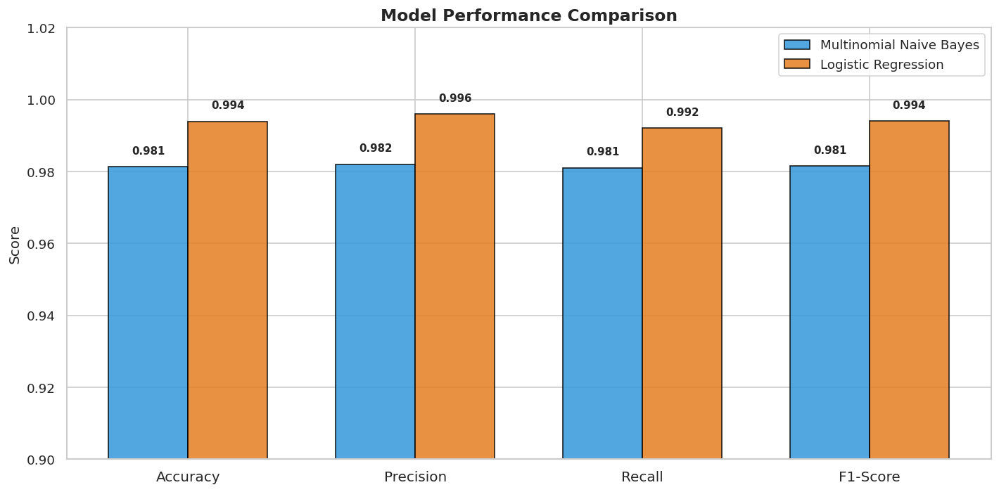

# 📰 Fake News Classifier & Deployment

## Overview
A complete NLP pipeline that classifies news articles as **Fake** or **Real**,
starting from raw text all the way to a live Gradio web application.

The project covers Exploratory Data Analysis, text preprocessing, TF-IDF
vectorization, training and comparing two machine learning models, and deploying
the best model as an interactive web app.

---

## Dataset
| Property | Value |
|---|---|
| File | `data/fake_and_real_news.csv` |
| Feature used | `Text` — full body of the news article |
| Target | `label` — `Fake` or `Real` |
| Total samples | ~9,900 |
| Class balance | Roughly balanced |

---

## Key Findings from EDA
- **Fake articles** tend to be **longer** than real ones on average.
- **Fake articles** use more emotionally charged, sensational vocabulary.
- **Real articles** use more formal, factual, policy-oriented language.
- The dataset is well-balanced between Fake and Real classes.

---

## Preprocessing Steps Applied
1. **Lowercasing** — normalize all text to lowercase
2. **Punctuation removal** — strip all punctuation characters
3. **Stopword removal** — remove common English stopwords (NLTK list)
4. **TF-IDF vectorization** — `max_features=10000`, `ngram_range=(1,2)`

---

## Model Comparison

| Model | Accuracy | Precision | Recall | F1-Score |
|---|---|---|---|---|
| Multinomial Naive Bayes | 0.969 | 0.97 | 0.97 | 0.97 |
| **Logistic Regression** | **0.996** | **1.00** | **0.99** | **1.00** |

---

## Final Model

**Model:** Logistic Regression  
**Accuracy:** 0.996  
**Why this model?**  
Logistic Regression outperforms Multinomial Naive Bayes because it does **not**
assume feature independence. Real-world text features (TF-IDF weights) are
correlated, and Logistic Regression models these relationships more accurately,
resulting in a ~2.7% improvement in accuracy and near-perfect F1-Score.

---

## Web Application

Deployed using **Gradio**.

### Screenshots








---

## Installation

```bash
git clone https://github.com/roton43/fake-news-classifier
cd fake-news-classifier
pip install -r requirements.txt
```

---

## Usage

### Step 1 — Run EDA
Open and run `notebooks/1_eda.ipynb` in Jupyter.

### Step 2 — Train the model
Open and run `notebooks/2_training.ipynb` in Jupyter.  
This saves `models/best_model.pkl`.

### Step 3 — Launch the web app
```bash
python app.py
```
Then open the local URL shown in the terminal (default: `http://127.0.0.1:7860`).

---

## Project Structure

```
fake-news-classifier/
├── data/
│   └── fake_and_real_news.csv
├── notebooks/
│   ├── 1_eda.ipynb          # Exploratory Data Analysis
│   └── 2_training.ipynb     # Model Training & Comparison
├── models/
│   └── best_model.pkl       # Saved pipeline (generated after training)
├── screenshots/
│   └── gradio_interface.png # Screenshot of the web app
├── app.py                   # Gradio deployment
├── requirements.txt
└── README.md
```

---

## Technologies Used

| Category | Libraries |
|---|---|
| Data manipulation | Pandas, NumPy |
| NLP preprocessing | NLTK |
| Visualization | Matplotlib, Seaborn |
| Machine learning | Scikit-learn |
| Model persistence | Joblib |
| Web deployment | Gradio |
